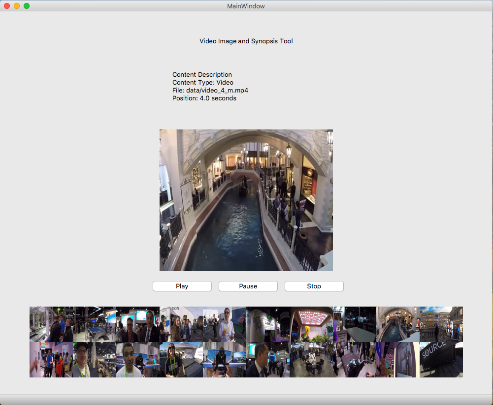

# VideoSynopsis

## Introduction 

These days there is no dearth of prolific media content that people create for themselves (video of family, friends, personal events etc, or images of vacations, weddings etc.) or available commercially such as movies, documentaries, sports videos. The assumed way to navigate and browse media content is to browse to a location (folder, http: site) and a list of media files are listed for you – either via a file list, thumbnails, or http based thumbnail pointers. The normal metaphor people follow to view them is by clicking on them and load in a photobrowser or view them in a video player. They can then “linearly” progress (from frame to frame) by playing the video or move from photo to photo. For video, you may also use trick play (fast forward) for watching or randomly access the stream. While all these get the job of “viewing” done, it is very time consuming and does not provide a “wholistic” view of all the content in a location.

We have implemented a media synoposis algorithm that produces a “synopsis image” summarizing media content. Synopsis is an ancient Greek word that means “general view” or a “summary view”. As input you will take a path to a folder that contains various visual media elements – video (with audio) and images. Normally all these media elements at one location (folder, http address) should be contextual similar eg video and images of a personal event such as vacation, graduation, wedding. The synopsis image gives us a good flavor and representation of all the media content.  

We also created an interactive player that can interact with this “synopsis” image so that when we click on some location of the synopsis image, this will trigger the corresponding video to play (with audio synchronized) from that contextual location or show the corresponding image.

## Input Data

A folder which contains:
1. A video file's frames in `.rgb` SGI format (352x288) and a corresponding audio file in WAV
format, synced to video.
2. Images in a `.rgb` SGI format (352x288)

Frame Rate - 30 fps

## Output

The following key entities are generated:
1. A synopsis image (or a hierarchy of images) for the media elements in the input folder. This image will a visual representation of all the “important” parts of the media elements.
2. `metadata.pkl` is generated for feeding to GUI
3. PythonQT player GUI used to render the synopsis

## Algorithm

A score of every frame is created using the following bases:

| Basis of scoring       | Score           |Comments|
| ------------- |:-------------:| :-------|
| Pyscenedetect | +30 | Returns frames where scene changes occur  |
| Maximal Cumulative Difference of frames     | +30  |   Stores and sorts absolute difference of consecutive frames |
| Image Variance | +10 |   Variance sorted frames, top 100 are given +10 score |
| Spectral Density | +10 | Log of fft 2d taken to estimate power of freqs, top 50 are given +10 score |
| Audio Spectral Density | +25 | Power Spectrum of STFT windows taken as well as MFCC DC component to get an idea of loudness and intensity of sound. Top 100 are given +25 score | 

Once the frames are scored, those that occur within 10 seconds of each other are merged (left to right), to ensure that only one frame in a 10 second window are chosen. Scores are simply added arithmetically and one super score is given to head frame of an interval. 

For our experiment's purpose we thresholded for scores and sorted the frames based on timestamp and ran a simple Kmeans (#selected/4) and selected images for synopsis closest to the K-centers. This is done to avoid over selection and maintain a logical gap between two frames that summarize the video chunk. 

For images, we run a PCA and Kmeans clustering and pick the images closest to the center to form a part of the synopsis. K is decided by the value that gives the best average distribution. 

The final synopsis is a concatenated image of shrunk selected frames saved as `synopsis.png`. 

## GUI

The guided user interface is written in Python using the PyQt5 Library (a wrapper around the C++ Qt visualization library). The interface consists of various widgets stacked and overlayed on top of each other. Primarly our UI uses buttons, labels, and a video/image player to render our content. There are 3 buttons: pause, play and stop. At the bottom of the window as shown in the screenshot there is a synopsis image. 

### Actions
**Click on Synopsis -** Loads video or image at location of click into synopsis image into player. If video, starts playing.  
**Play Button -** Plays video currently loaded into player from last paused position.  
**Pause Button -** Pauses the currently loaded video at current position.  
**Stop Button -** Resets position of video currently loaded into player to beginning (as specified by synopsis/metadata).  
